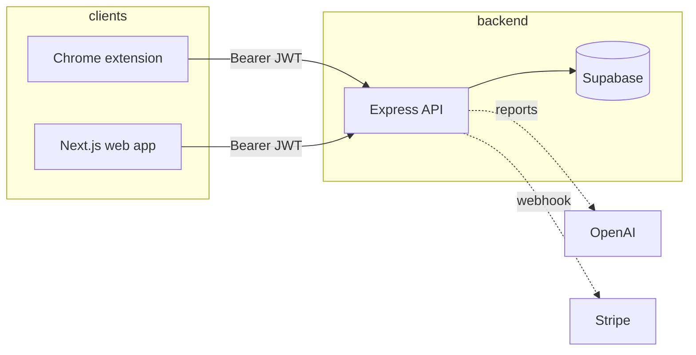
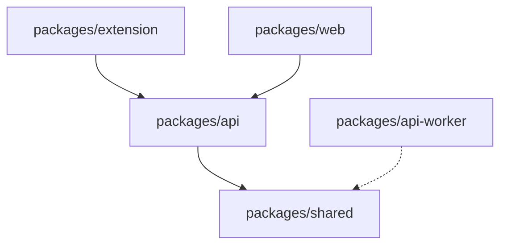

<div align="center">

# Recount

[](https://github.com/Hum2a/Recount/releases/tag/v0.2.1)

### Honest productivity tracking with intentions, tab time, and AI accountability

<sub>Chrome extension · Next.js dashboard · Express API · Supabase · Stripe · OpenAI</sub>

[](https://github.com/Hum2a/Recount/releases)
[](https://nodejs.org/)
[](./package.json)
[](./.github/workflows/ci-security.yml)

| Stack | |
| :--- | :--- |
| **Extension** | Chrome MV3 · passive domain tracking |
| **API** | Node.js · Express · Zod |
| **Web** | Next.js 14 · App Router |
| **Data & auth** | Supabase |
| **Billing & AI** | Stripe · OpenAI · Resend |

[Features](#features) · [Architecture](#architecture) · [Quick start](#quick-start) · [Documentation](#documentation) · [Security](#security) · [Contributing](./CONTRIBUTING.md)

</div>

---

## Table of contents

<!-- vim-markdown-toc GFM -->

* [TL;DR](#tldr)
* [Features](#features)
* [Architecture](#architecture)
* [Repository layout](#repository-layout)
* [Quick start](#quick-start)
* [Development scripts](#development-scripts)
* [Chrome extension](#chrome-extension)
* [API overview](#api-overview)
* [Roles vs premium](#roles-vs-premium)
* [Production deployment](#production-deployment)
* [Documentation](#documentation)
* [Security](#security)
* [Testing and CI](#testing-and-ci)
* [Project name](#project-name)
* [License](#license)

<!-- vim-markdown-toc -->

---

## TL;DR

> **Recount** is a monorepo: a **Chrome extension** records time by domain, a **Next.js** dashboard shows activity and reports, and an **Express API** ties it together with **Supabase**, **Stripe** licensing, and optional **OpenAI** summaries — aligned with a FocusTrack-style workflow (intentions + honest tab data).

```bash
git clone https://github.com/Hum2a/Recount.git
cd Recount
npm install
# configure env (see Quick start), then:
npm run dev:api    # :3001
npm run dev:web    # :3000
```

---

## Features

| Capability | Notes |
| :--- | :--- |
| Passive tab tracking | By domain; optional titles; batch upload to API |
| Daily intentions | Goals vs. how you actually spent time |
| Dashboard & history | Next.js app; free tier has a rolling history window |
| AI accountability reports | Licensed users; OpenAI-backed summaries |
| Stripe checkout | One-time license; webhook updates profile |
| Staff / admin tools | Elevated roles for support and analytics |
| Cloudflare path | Worker deploy targets + scripts in repo |

---

## Architecture

High-level request flow from browser → API → database:



<details>
<summary><strong>Expand: package dependency mental model</strong></summary>



</details>

---

## Repository layout

| Path | Role |
| :--- | :--- |
| [`packages/shared`](./packages/shared) | Shared domain classification & helpers |
| [`packages/api`](./packages/api) | Primary Express API |
| [`packages/api-worker`](./packages/api-worker) | Cloudflare Worker API (migration target) |
| [`packages/extension`](./packages/extension) | Chrome MV3 extension |
| [`packages/web`](./packages/web) | Next.js marketing + dashboard |
| [`docs/`](./docs/) | Integrations & Cloudflare deploy guides |
| [`scripts/`](./scripts/) | Deploy & env sync helpers |

---

## Quick start

### Prerequisites

- **Node.js 20+** (see [`.nvmrc`](./.nvmrc); root `package.json` `engines` requires `>=20`)
- **Supabase** project (SQL migrations + Auth)
- **npm** workspaces (root `npm install`)

### 1. Database migrations

Run SQL from [`packages/api/src/db/migrations/`](./packages/api/src/db/migrations/) **in order**:

- **Supabase SQL editor:** paste and run each file in filename order.
- **CLI (Postgres URI):** set **`DATABASE_URL`** (or **`SUPABASE_DB_URL`**) to your Supabase **database** connection string (Project Settings → Database), optionally in `packages/api/.env`, then from the repo root run **`npm run db:migrate`**.

Files include through **`005`**, optional **`006`**, **`007`**, optional **`008`**, optional **`009`**, optional **`010_rls_select_own_or_staff.sql`**, **`011_stripe_webhook_events.sql`** (Stripe webhook idempotency), **`012_profile_blocked_domains.sql`** (extension never-track list on `profiles`), **`013_report_generation_events.sql`** (report generate soft rate limit ledger).  
For **`010`**: JWT **`SELECT`** own rows + admin/developer **`SELECT`** on core tables; writes stay behind the API.

### 2. Environment files

| File | Copy from |
| :--- | :--- |
| `packages/api/.env` | `packages/api/.env.example` |
| `packages/web/.env.local` | `packages/web/.env.example` |

> **Local API “relaxed” mode:** With `NODE_ENV=development` (default), missing keys in `packages/api/.env` may be replaced by **dev placeholders** so the API boots for UI work. Auth, Stripe, OpenAI, and Resend stay non-functional until you set real values. For strict local validation, set `RELAXED_ENV=0`.

### 3. Install & run

```bash
npm install
npm run dev:api     # http://localhost:3001 — keep this running for the dashboard
npm run dev:web     # http://localhost:3000
```

The dashboard loads data from the API during server rendering; if you only start Next.js, you’ll see a connection error until `dev:api` is up.

**Integrations** (Stripe, OpenAI, Resend, store URLs): [`docs/integrations-setup.md`](./docs/integrations-setup.md)  
**Cloudflare deploy**: [`docs/cloudflare-native-deploy.md`](./docs/cloudflare-native-deploy.md)

---

## Development scripts

| Command | Description |
| :--- | :--- |
| `npm run dev:api` | API on default **:3001** |
| `npm run dev:api:worker` | Cloudflare Worker API (local) |
| `npm run dev:web` | Next.js on **:3000** |
| `npm run build` | Build all workspaces that define `build` |
| `npm run build:extension` | Output → `packages/extension/dist` |
| `npm run sync:cf:env` | Sync Cloudflare env |
| `npm run deploy:cf` | API worker then web worker (see script notes for Windows) |
| `npm run db:migrate` | Apply `packages/api/src/db/migrations/*.sql` in order (`DATABASE_URL` / `SUPABASE_DB_URL`) |

<details>
<summary><strong>Windows build tips</strong></summary>

If `next build` runs out of memory:

```bat
set NODE_OPTIONS=--max-old-space-size=8192
npm run build -w @recount/web
```

If you see **`ENOSPC`**, free disk space and consider removing `packages/web/.next` before retrying.

</details>

---

## Chrome extension

| Topic | Detail |
| :--- | :--- |
| **Dev** | Load unpacked `packages/extension` from `chrome://extensions/` |
| **Production build** | `npm run build:extension` → load `packages/extension/dist` |
| **Site access** | Host permissions are **optional** (`http://*/*`, `https://*/*`). First install can open **Options** to grant access; tracking is off until granted |
| **API / web URLs** | Defaults in `packages/extension/src/utils/constants.js` (`WEB_APP_ORIGIN` for the Next app, API URL for Workers). Override in extension Options. |
| **CORS** | Add `chrome-extension://<extension-id>` to API **`ALLOWED_ORIGINS`** for deployed APIs |

Session note: extension and website sessions are separate; use the same credentials if both prompt for login.

---

## API overview

| Method | Path | Notes |
| :--- | :--- | :--- |
| `GET` | `/health` | Liveness |
| `POST` | `/api/auth/signup` \| `/login` \| `/refresh` | Auth |
| `POST` | `/api/events/batch` | Batch tab events |
| `GET` | `/api/events/summary` | Daily summary |
| `GET` | `/api/events/me/activity/*` | Personal activity (free tier: date window) |
| `POST` | `/api/intentions` | Save intentions |
| `GET` | `/api/intentions/:date` | Read intentions |
| `POST` | `/api/reports/generate` | AI report (licensed) |
| `GET` | `/api/profiles/me` | Profile |
| `PATCH` | `/api/profiles` | Update self |
| `POST` | `/api/payments/create-session` | Stripe checkout |
| `POST` | `/api/payments/webhook` | Stripe webhook (raw body) |

Staff routes live under `/api/admin/*` (see codebase). Full behavior and RLS notes remain in migration docs.

---

## Roles vs premium

| Concept | Storage | Meaning |
| :--- | :--- | :--- |
| **Premium** | `profiles.license_active` | Set via Stripe `checkout.session.completed`; gates licensed features (`requireLicense`) |
| **App role** | `profiles.app_role` | `user` · `admin` · `developer` — **independent of billing**; used for staff APIs / UI |

Promote first admin in Supabase (example):

```sql
UPDATE public.profiles
SET app_role = 'admin'
WHERE email = 'you@example.com';
```

---

## Production deployment

1. **HTTPS API** (Railway, Fly.io, Render, VPS + reverse proxy). Example: `https://api.yourdomain.com`
2. **Run** `packages/api` with **`NODE_ENV=production`**, real secrets from `.env.example` — no dev placeholders
3. **`ALLOWED_ORIGINS`**: web origin(s) + `chrome-extension://…` for your published extension ID
4. **Stripe webhook**: `POST /api/payments/webhook` — event `checkout.session.completed`; set `STRIPE_WEBHOOK_SECRET`
5. **Monitor**: `GET /health` → `{ "status": "ok" }`

CI deploy workflow: [`.github/workflows/deploy-cloudflare.yml`](./.github/workflows/deploy-cloudflare.yml) (push to `main` or manual).

---

## Documentation

| Document | Purpose |
| :--- | :--- |
| [`docs/integrations-setup.md`](./docs/integrations-setup.md) | Third-party services & feature matrix |
| [`docs/cloudflare-native-deploy.md`](./docs/cloudflare-native-deploy.md) | Workers + npm deploy commands |
| [`SECURITY_HARDENING.md`](./SECURITY_HARDENING.md) | Security checklist & verification |
| [`CONTRIBUTING.md`](./CONTRIBUTING.md) | How to contribute |
| [`SECURITY.md`](./SECURITY.md) | Responsible disclosure |
| [`SUPPORT.md`](./SUPPORT.md) | Where to ask for help |
| [`CHANGELOG.md`](./CHANGELOG.md) | Release history |
| [`docs/SECURITY_FINDINGS.md`](./docs/SECURITY_FINDINGS.md) | Security backlog (prioritized findings) |
| [`docs/IMPROVEMENTS_BACKLOG.md`](./docs/IMPROVEMENTS_BACKLOG.md) | Improvements & tech debt backlog |

---

## Security

- Hardening summary: **[`SECURITY_HARDENING.md`](./SECURITY_HARDENING.md)**
- Reporting vulnerabilities: **[`SECURITY.md`](./SECURITY.md)**

---

## Testing and CI

| Check | Command / location |
| :--- | :--- |
| API tests | `npm run test -w @recount/api` |
| Web lint | `npm run lint -w @recount/web` |
| Security CI | [`.github/workflows/ci-security.yml`](./.github/workflows/ci-security.yml) |

---

## Project name

The specification referenced **FocusTrack**; this repository uses **Recount** as the product name.

---

## License

This project is licensed under the **MIT License** — see [`LICENSE`](./LICENSE).

---

<div align="center">

**Built with** `Node` · `Next.js` · `Express` · `Supabase` · `Stripe`

⭐ *If Recount helps you stay accountable, consider starring the repo.*

</div>
